## Sky Theme for Hyprland and Nixos

> Important: currently developing eww widgets for rofi replacement

A fully reproducible and modular NixOS setup using Hyprland, themed entirely in a sleek and dreamy Sky aesthetic.  
Everything from system UI (Waybar, Mako, SDDM) to applications (Neovim, VSCode, Thunar, GTK, Rofi) follows a unified sky-themed look.

> Managed entirely via flakes and home-manager — no config files in `~/.config`!

## Features

- **Hyprland** with sky blur, animations.
- **Waybar** with blur, sky colors, and clean modules.
- **Mako** for themed notifications.
- **Rofi** menus styled with sky gradient and blur.
- **Modular flake** setup — easy to maintain and extend.
- **Kitty**, **Thunar**, **Brave**, **VSCode**, **Neovim**, and more fully themed.
- **SDDM** with Sugar Candy + Sky accent theme.
- GTK apps themed with matching Sky look.
- Purely declarative with **Home Manager** and **Nix Flakes**.

## Getting Started

> Prerequisites: You must be using **NixOS Unstable** and have **flakes** enabled.

1. **Clone the repository**

   ```bash
   git clone https://github.com/yourname/nix-config ~/nix-config
   cd ~/nix-config
   ```

2. **Edit your `flake.nix`** to point to your hostname and username. Just that!

3. **Copy your `hardware-configuration.nix`**

   > important: this is for my pc, so for yours you should yours.

   ```bash
   rm modules/system/hardware-configuration.nix
   sudo cp /etc/nixos/hardware-configuration.nix ~/nix-config/modules/system/hardware-configuration.nix
   ```

4. **Rebuild your system and Activate home-manager**

   ```bash
   sudo nixos-rebuild switch --flake .#your-hostname
   home-manager switch --flake .#your-username
   ```

## Screenshots

| hyprland                                 |                                         |
| ---------------------------------------- | --------------------------------------- |
| 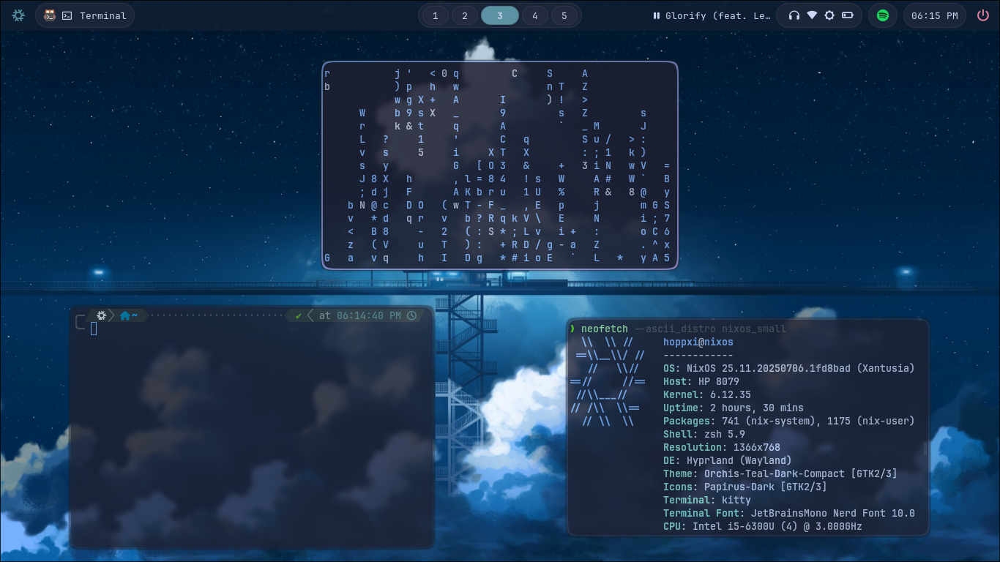 | 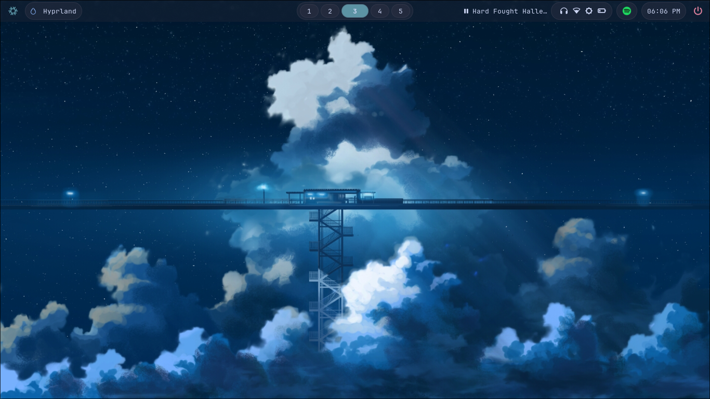 |

| waybar                                |
| ------------------------------------- |
| 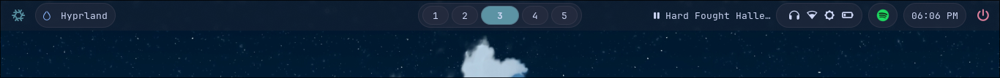 |

| vscode                                | neovim                                | gtk                                | kitty                                |
| ------------------------------------- | ------------------------------------- | ---------------------------------- | ------------------------------------ |
|  | 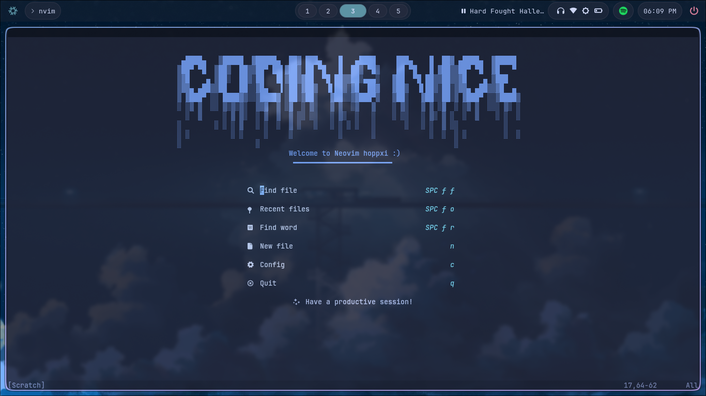 | 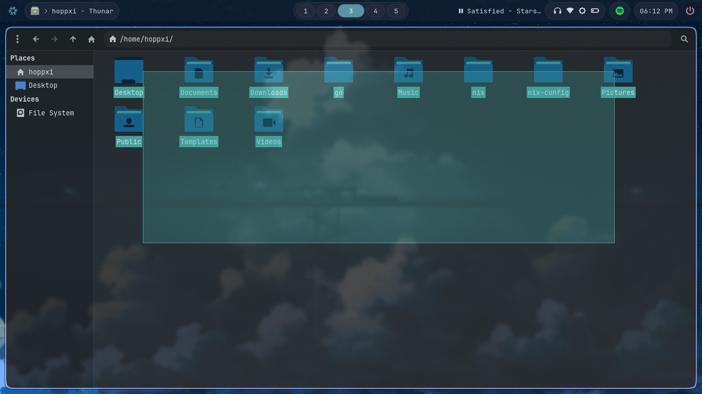 | 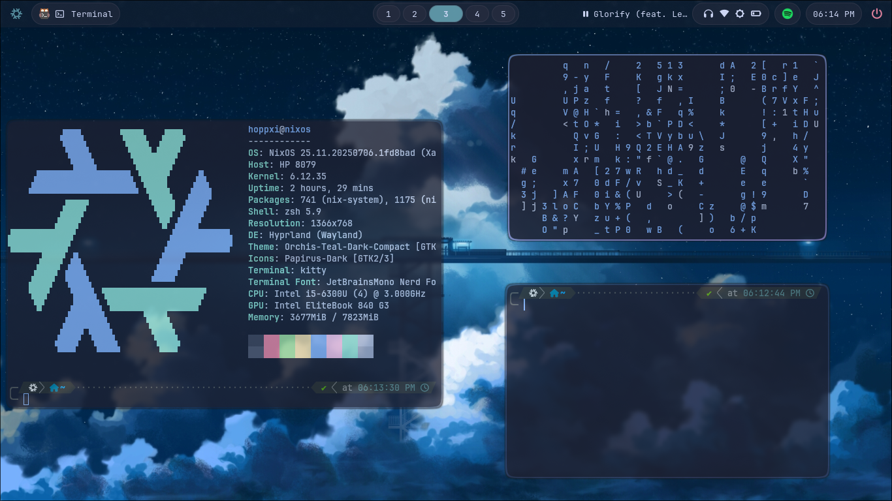 |

| Power menu                           | wifi menu                           | battery                                | backlight                                | volume                                |
| ------------------------------------ | ----------------------------------- | -------------------------------------- | ---------------------------------------- | ------------------------------------- |
| 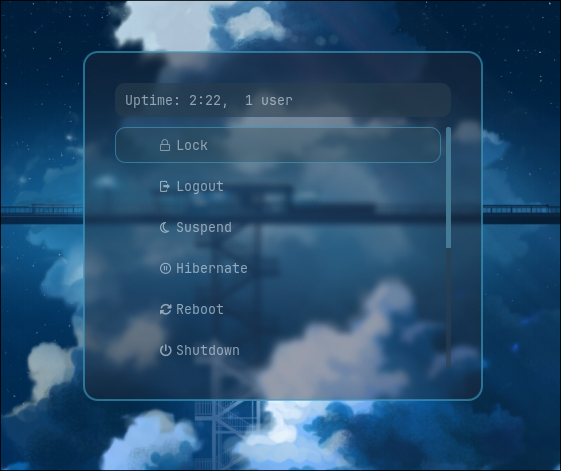 | 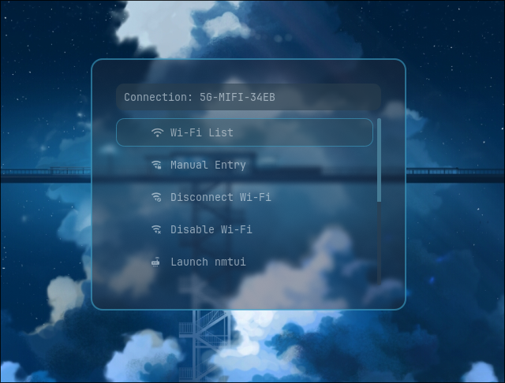 | 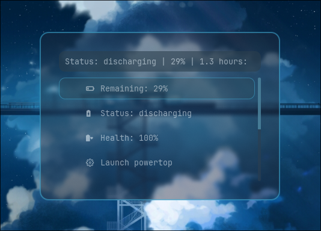 | 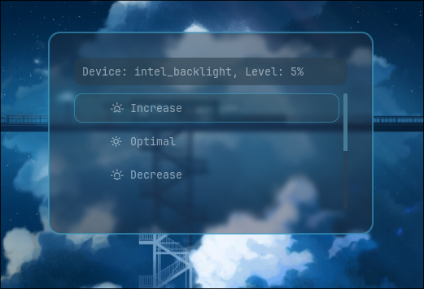 | 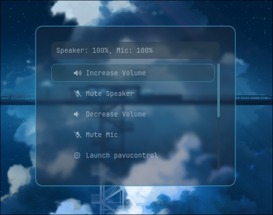 |

| mpris                                | screenshot                                | clipboard                                | Launcher                                | mako                                |
| ------------------------------------ | ----------------------------------------- | ---------------------------------------- | --------------------------------------- | ----------------------------------- |
| 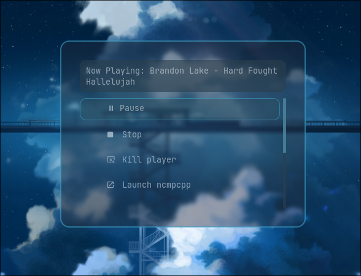 | 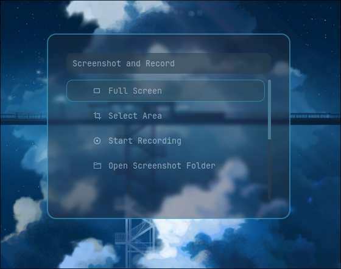 | 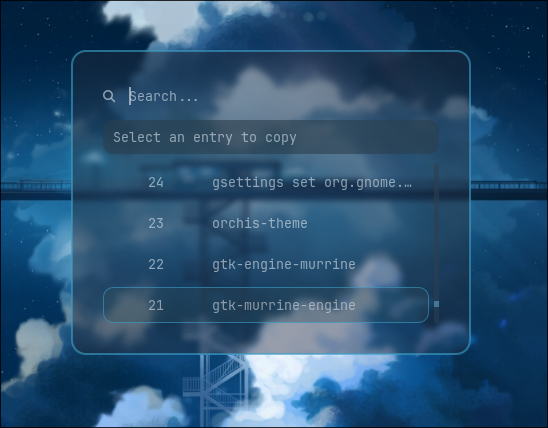 | 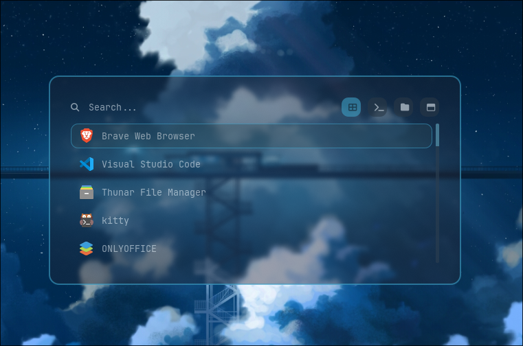 | 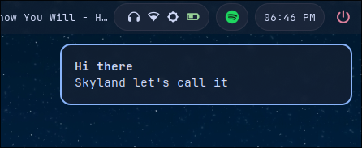 |

## Credits

- Hyprland
- [Mechabar](https://github.com/sejjy/mechabar) for scripts
- [Rofi](https://github.com/adi1090x/rofi) for themes and scripts
